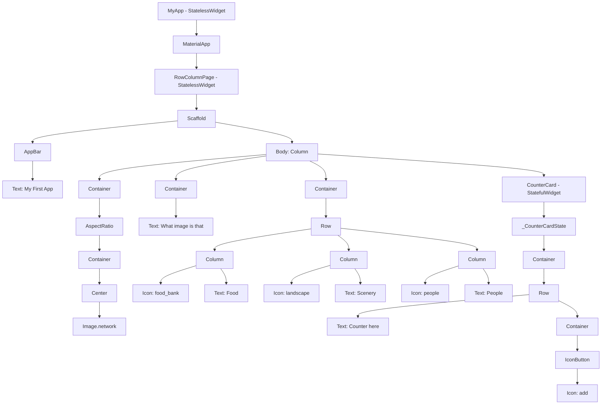

# Tugas 1 - Pemrograman Perangkat Bergerak (D)

Dokumen ini menjelaskan semua widget yang digunakan pada proyek Flutter di folder `tugas_2`.

## Nama dan NRP:
- Nama: Pranandha Dhaiva Dhaniswara
- NRP: 5025231260

## Daftar Widget dan Fungsinya

1. **MyApp** (`StatelessWidget`)  
   Widget root aplikasi. Tidak memiliki state yang berubah.

2. **MaterialApp**  
   Pembungkus utama aplikasi Material Design. Mengatur `title`, `theme`, dan halaman awal (`home`).

3. **RowColumnPage** (`StatelessWidget`)  
   Halaman utama yang menampilkan gambar, teks deskripsi, kategori ikon, dan kartu counter.

4. **Scaffold**  
   Kerangka halaman standar Material, berisi `appBar` dan `body`.

5. **AppBar**  
   Header bagian atas halaman, digunakan untuk menampilkan judul aplikasi.

6. **Text**  
   Menampilkan teks seperti judul, label kategori, dan nilai counter.

7. **Column**  
   Menyusun widget secara vertikal (atas ke bawah).

8. **Row**  
   Menyusun widget secara horizontal (kiri ke kanan).

9. **Container**  
   Widget serbaguna untuk mengatur ukuran, margin, padding, warna latar, dan child.

10. **AspectRatio**  
    Menjaga rasio ukuran child tetap proporsional (di proyek ini rasio 1:1).

11. **Center**  
    Memusatkan posisi child di dalam parent.

12. **Image.network**  
    Menampilkan gambar dari URL internet.

13. **Icon**  
    Menampilkan ikon Material seperti ikon makanan, pemandangan, orang, dan tombol tambah.

14. **CounterCard** (`StatefulWidget`)  
    Widget custom yang memiliki state untuk menyimpan nilai counter.

15. **_CounterCardState** (`State<CounterCard>`)  
    Kelas state untuk `CounterCard`, menyimpan nilai `_counter` dan memanggil `setState()` saat nilai berubah.

16. **IconButton**  
    Tombol berbasis ikon untuk menambah nilai counter.

## Komponen Pendukung (Bukan Widget Utama)

- **MediaQuery**: Mengambil informasi ukuran layar (`width` dan `height`).
- **EdgeInsets**: Mengatur margin dan padding.
- **ThemeData** dan **ColorScheme**: Mengatur tema aplikasi.
- **setState()**: Memicu rebuild UI saat state berubah.

## Widget Tree Diagram

## Screenshot

